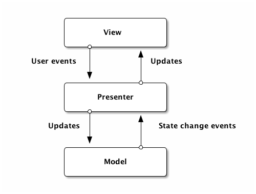

= MVW (Model-View-Whatever)

Hay algunos patrones muy tipicos a la hora de desarrollar una UI, pero es muy dificil encontrar una explicacion clara sobre cada uno de ellos, por eso voy a intentar escribir mi propia explicacion de cada uno.

* MVC (Model - View - Controller)
* MVP (Model - View - Presenter)
* MVVM (Model - View - ViewModel)

== MVC (Model-View-Controller) 

https://en.wikipedia.org/wiki/Model-view-controller[wikipedia]

Este tal vez sea el mas conocido, pero tambien el mas malentendido. El patron MVC surge como solucion a mantener separado 3 preocupaciones: visuals (View), data (Model), and logic (Controller). Este patron es simple de entender pero dificil de implementar dado que su descripcion es muy generica: Un triangulo donde todas las partes se pueden comunicar con las otras.
El problema es que esas conexiones pueden ser pasivas, por ejemplo algunos dicen que la View solo puede leer del modelo, pero no actualizarlo, mientras que otros dicen que los datos viajan en ambos sentidos.

El siguiente diagrama representa una de las muchas formas en las cuales este patron puede ser implementado, las lineas punteadas representan links pasivos.

image::images/MVC.png[]

== MVP (Model-View-Presenter)

https://en.wikipedia.org/wiki/Model-view-presenter[wikipedia]

Este patron surgio como contrapunto de MVC, intentando resolver el problema del triangulo. En este patron la View es pasiva y solo reacciona a datos enviados por el Presenter, que vienen desde el Model. La vista puede redireccionar los eventos de usuarios al Presenter pero no conocer el Model. El Model recibe los updates desde el Presenter y notifica cualquier cambio de estado, resultando en un modelo isolado. Solo el Presenter conoce a los otros dos miembros de este patron (Model & View).

== MVVM (Model-View-ViewModel)

https://en.wikipedia.org/wiki/Model-view-viewmodel[wikipedia]

En esta version existe un binding entre la View y el ViewModel. El ViewModel es responsable de abstraer todos los input/outputs mientras provee comportamiento. Este simplifica (en teoria) el testing de la aplicacion, ya que el ViewModel tiene todo el comportamiento y esta separado de la View. Tal vez lo mas interesante de este patron es la existencia del Binder, el cual es usado para sincronizar los datos entre la View y el ViewModel.

References

* https://www.beyondjava.net/model-view-whatever
* http://khanlou.com/2014/03/model-view-whatever/
* http://griffon-framework.org/tutorials/5_mvc_patterns.html#_tutorial_5_1_1